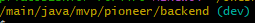

Для запуска проекта необходимо:
1. Скачать и установить docker. Для windows - это Docker Desktop  
2. Скачать и установить git bash
3. Открыть git bash в директории, где хотите развернуть проект
4. Выполнить команду 
   ```bash
    git clone https://github.com/Spark11e/PIONEER.git
    ```
5. Перейти в клонированную директорию. git bash должен указывать на активную ветку `(main)`. Выполнить команду
    ```bash
   git switch dev
   ```
   Данная команда сменит ветку на (dev), в которой ведется разработка  
      
6. Далее, в корневой папке проекта необходимо выполнить команду
    ```bash
   docker-compose up
   ```
7. Дождитесь успешного деплоя приложения. Мониторить состояние можно в docker desktop
8. После того, как приложение встало, перейдите по ссылке http://localhost:8181/swagger-ui/index.html. На данной странице представлено API приложения